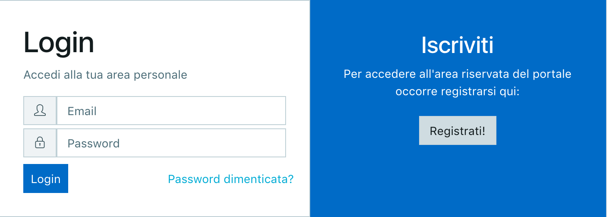

****************************************
Registrazione e accesso all'area privata
****************************************

=============
Registrazione
=============

Accedere alla pagina https://dataportal-private.daf.teamdigitale.it direttamente o tramite il pulsante *Accedi* presente sul portale pubblico. Cliccare su *Registrati!* e fornire le informazioni richieste, quindi cliccare su *Crea Account*. In mancanza di segnalazioni (nel qual caso è necessario prima risolverle) il sistema provvederà all'invio di un link di attivazione all'indirizzo email indicato.

Nota
    Il nome utente può essere composto esclusivamente da caratteri alfanumerici e dai seguenti caratteri speciali: ``-`` (dash) e ``_`` (underscore). La password deve essere formata da almeno 8 caratteri e contenere almeno una lettera maiuscola e almeno un numero.

   La schermata di login.

==========================
Autenticazione e home page
==========================

Accedere alla pagina https://dataportal-private.daf.teamdigitale.it direttamente o tramite il pulsante *Accedi* presente sul portale pubblico. Utilizzare l'indirizzo email e la password definiti in fase di registrazione. 

Eseguito l'accesso viene proposta la home page della sezione privata, che sulla sinistra presenta un menu da quale è possibile accedere alle funzionalità e agli strumenti di analytics. Il menu può essere ridotto e riespanso cliccando sulla barra in calce allo stesso.

In primo piano compare una sintesi dei dataset, delle dashboard, dei widgets e delle storie visibili all'utente, e la possibilità di accedere rapidamente alla rispettiva sezione o al dettaglio.

Cliccando sul menu a tendina accanto al proprio nome utente, è possibile visualizzare i dettagli del proprio profilo. Oltre alle informazioni fornite in fase di registrazione, sono riportate anche indicazioni sul ruolo di cui si è in possesso e sulle organizzazioni di cui si fa parte. Dallo stesso menu è possibile anche eseguire il logout.

In qualsiasi momento è possibile ritornare alla home cliccando su *Home*, prima voce nel menu laterale.

===============
Reset password
===============

La funzionalità, disponibile dalla pagina di autenticazione, permette sia di ripristinare l'accesso alla sezione privata del portale nel caso non si ricordi la password, sia di modificare la propria password. A tal fine fornire la mail utilizzata in fase di registrazione, alla quale, se corretta, verrà inoltrato un link. Utilizzare il form per indicare la nuova password.
