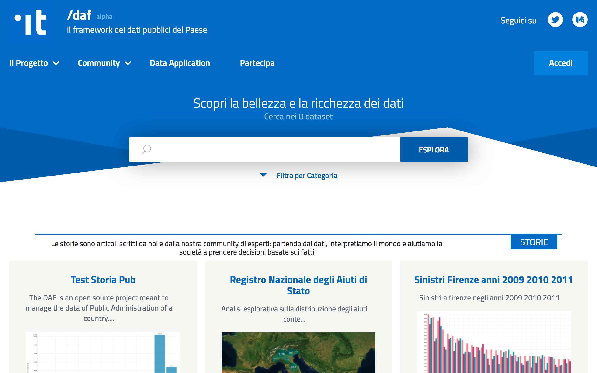

Dataportal: area pubblica
=========================

L'area pubblica del Dataportal è disponibile all'indirizzo `dataportal.daf.teamdigitale.it <https://dataportal.daf.teamdigitale.it/>`__. 

L'area pubblica rappresenta il punto di raccordo degli open data della PA e il punto di accesso al DAF.
Essa costituisce l'evoluzione del sito `dati.gov.it <https://www.dati.gov.it/>`__ *- i dati aperti della Pubblica Amministrazione*.

   Area pubblica del Dataportal.

.. note::

   Per poter accedere al catalogo degli open data presenti nella piattaforma, l'utente deve prima `effettuare la registrazione <../dataportal-privato/registrazione-login/index.html>`_ al Dataportal, seguendo le stesse indicazioni per l'accesso all'area privata.

Oltre al catalogo degli open data, l'utente avrà accesso alle *data stories* condivise dagli utilizzatori del DAF, potrà ricercare e utilizzare le Data Application presenti sulla piattaforma, informarsi sulle novità provenienti dal mondo dei dati pubblici, e tanto altro.

In questa area sarà inoltre disponibile una sezione dedicata agli analisti e agli sviluppatori di Data Application contenente documentazione tecnica e schede informative sulle funzionalità del DAF.

LINK ALLE SEZIONI

* Catalogo dati

* Data stories

* Novità e documentazione
