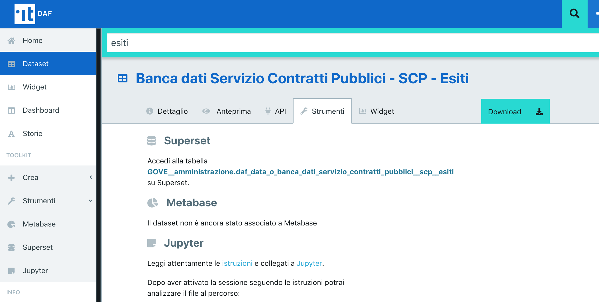
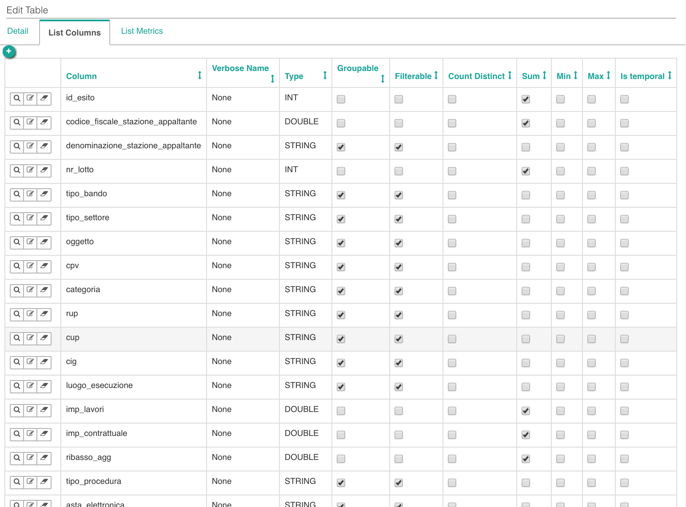
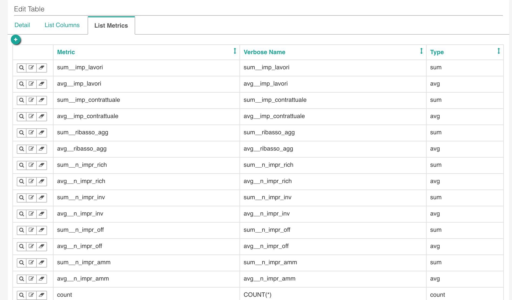
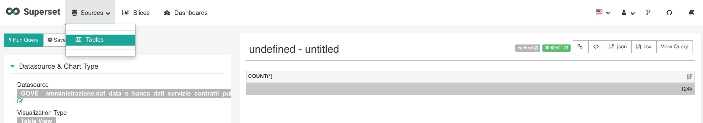
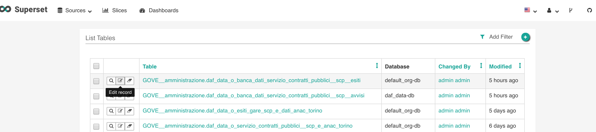
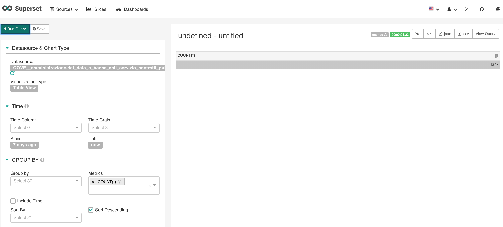
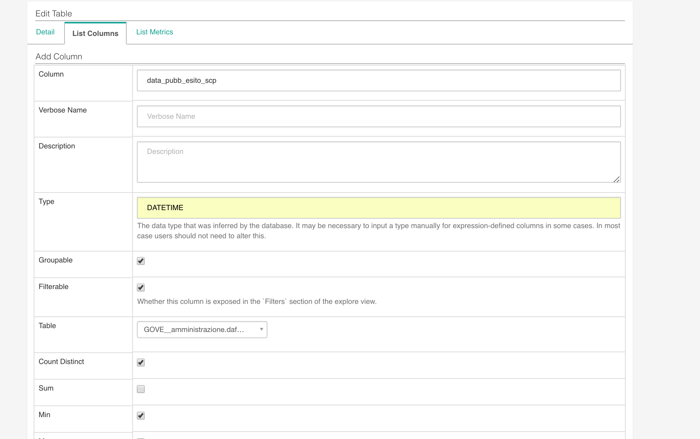
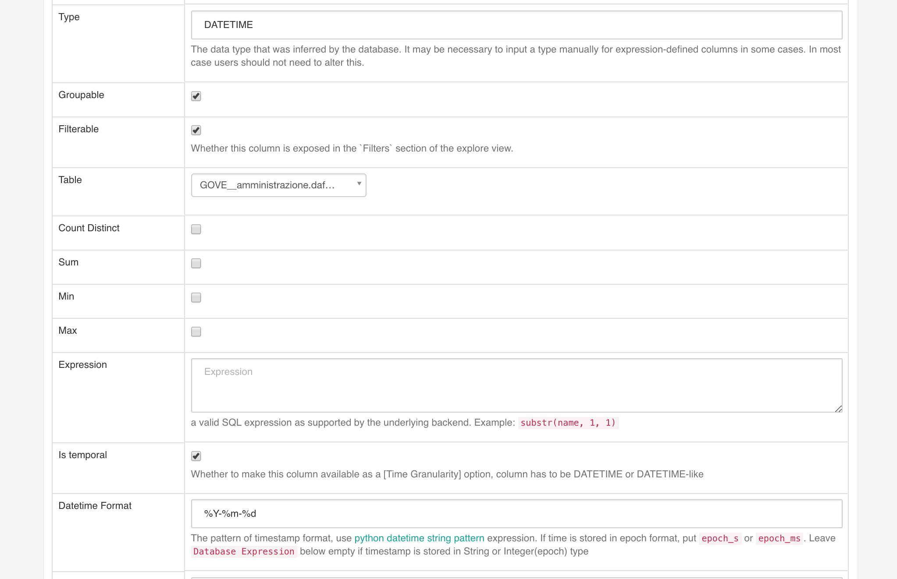

******************************************
Superset: strumento per data visualization
******************************************

`Superset <https://github.com/apache/incubator-superset>`_ è un'applicazione Web open-source di Business Intelligence, sviluppata da AirBnB, con cui è possibile creare grafici ('slices' nel gergo di Superset), dashboard ed eseguire query SQL.
Superset è stato integrato con il DAF per offrire agli utenti la possibilità di creare le proprie analisi e condividerle con la community in modalità self-service.

Questa sezione è pensata per fornire indicazioni utili alla creazione di tabelle e grafici.
Per approfondimenti sulle funzionalità e sulle modalità d'uso di Superset, si rimanda alle documentazione suggerita nella sezione 'Risorse Utili' di questa guida.

========================================
Utilizzare Superset su un dataset di interesse
========================================
Per accedere a Superset direttamente da dataset presente all'interno del dataportal è necessario:
* accedere alla scheda del dataset
* cliccare sul link della sezione “Superset” dal tab “Strumenti”
Verrai automaticamente indirizzato su Superset nella modalità di creazione di un widget

========================================
Proprietà del dataset
========================================
Prima di iniziare a costruire degi slicer è buona regola controllare che i campi del dataset e le metriche proposte siano conformi al tipo di informazione che si intende comunicare.

Ogni dataset è definito da un elenco di:

* campi: dati dalle misure quantitative (es: numero di abitanti, reddito, percentuale di disoccupazione) e dalle dimensioni di analisi (es.nome comune, fascia di reddito, tipologia di azienda). Le dimensioni consentono di determinare il metodo di raggruppamento dei dati provenienti dalla misura (es. mostrami la media della misura "reddito" per fascia di reddito e per comune) 
* metriche: Superset mette a disposizione per ogni campo diverse metriche che è possibile avere a disposizione inserendo la spunta sulla metrica di interesse. Stà all'utente valutare quali inserire e su quali campi abilitarle.

========================================
Configurazione di un dataset
========================================
Un utente può accedere alla homepage di Superset direttamente dal Dataportal grazie al menù laterale sinistro della sezione privata del Dataportal (sezione: Toolkit - Strumenti - Superset) oppure atterrare comodamente alla schermata di crezione di uno slicer attraverso la scheda del dataset mostrata in precedenza.

Una volta entrati in Superset dal menù Strumenti, si accede alla lista delle dashboard create nell'ambito dell'organizzazione a cui afferisce l'utente che ha effettuato l'accesso e della community.
Superset adotta infatti un approccio self-service: questo significa che ciascun utente, da un lato, potrà provvedere alla creazione dei grafici e delle dashboard; dall'altro potrà riutilizzare le tabelle, i grafici e le dashboard creati dalla community.
Chiaramente quest'ultima possibilità impone anche una certa disciplina nell'uso dello strumento, per evitare di interferire con le analisi fatte dagli altri utenti dell'organizzazione.

Il primo step nell'uso di Superset consiste nell'individuazione dei dataset oggetto di analisi.
Nella homepage selezionare la voce 'Tables' dal menu a tendina 'Sources'.

Scorrendo la lista è possibile trovare e selezionare la tabella che contiene il dataset di interesse, anche aiutandosi, all'occorrenza, con i filtri attivabili cliccando sul bottone in alto a destra 'Add Filter'.

Per accedere ai campi della tabella cliccare sull'icona "Edit"

Dopo aver selezionato la tabella verrà presentato un elenco in cui ogni riga è un campo del dataset.
Per ogni campo, se necessario è possibile ridefinire le proprietà elencate e creare nuovi campi derivati.
Per apportare le modifiche cliccare sull’icona matita a sinistra del campo

========================================
Controllo del dataset
========================================
Se si è in possesso di un'utenza editor e si è appena caricato il dataset sul dataportal, può essere utile controllare rapidamente se il numero di record caricati corrisponde a quelli attesi. 
E' possibile effettuare questo primo test selezionando nel campo Metrics “COUNTS (*)” e cliccando su “Run query”.

=================================
Definizione e modifica di un campo
=================================

Cliccando sul nome di un campo verrà presentata una scheda con le caratteristiche del campo.
E’ possibile indicare un “Verbose name” che sarà l’etichetta mostrata quando il campo verrà usato nei widget, una “description” che sarà mostrata come tooltip.

=================================
Definizione di un Campo con formato data
=================================
Per definire un campo che indica una data e che nella tabella originaria è impostato a STRING o con altre tipologie di dati è sufficiente cliccare sul campo di interesse e modificare il campo TYPE a DATETIME esplicitando il Datetime format utilizzato nel dataset.

=================================
Creazione di un grafico ('Slice')
=================================

Il prossimo step è creare un grafico con il dataset importato.
Come appena visto, utilizzando 'SQL Editor', il dataset contiene informazioni georeferenziate sui luoghi della cultura di Matera, per cui potrebbe essere una buona idea graficarle su una mappa utilizzando l'integrazione con MapBox.

A tal fine, cliccare sul menu 'Slices' posto nella barra in alto: comparirà l'elenco di slices già creati.
Anche in questo caso è possibile utilizzare filtri per cercare il grafico di interesse.
Per crearne uno nuovo, cliccare il bottone '+' in alto a destra.

.. image:: img_superset/conf_sliceadd_1.jpeg

Comparirà un menu dove si dovrà indicare la tabella da cui prendere i dati ('datasource'), e il tipo di visualizzazione da utilizzare.
Per graficare su una mappa selezionare 'Matbox'.
Infine cliccare sul bottone in basso a sinistra 'Create New Slice'.

.. image:: img_superset/conf_sliceadd_2.jpeg

L'ultimo step consiste nel configurare il grafico.
Nel caso in esempio vanno impostate le seguenti informazioni:

* latitudine e longitudine
* 'label', ovvero il testo che comparirà all'interno del punto disegnato sulla mappa
* 'Viewpoint' con le informazioni di latitudine, longitudine e zoom di default che verranno utilizzate per la visualizzazione iniziale.

Infine, eseguire la query che aggiorna il grafico, cliccando sul bottone 'Query' in alto a sinistra, e salvare la 'slice' cliccando sul pulsante 'Save'.

.. image:: img_superset/conf_sliceadd_3.jpeg

==========================
Creazione di una dashboard
==========================

Le dashboard sono aggregazioni di 'slices' utili a tenere su un unico pannello i grafici di interesse.
Per creare una dashboard in Superset occorre:

* Cliccare sul menu 'Dashboard' in alto
* Cliccare sul pulsante '+' in alto a sinistra
* Compilare i campi con le informazioni utili per la dashboard, come 'Title', 'Slug'(per rendere richiamabile tramite un URL la dashboard), 'Slices' (in cui elencare le slices che si vuole utilizzare nella dashboard; nel caso in esempio abbiamo selezionato 'Matera - Luoghi Cultura' e 'Heatmap') e 'Owners' (in cui indicare chi può contribuire alla dashboard).
* Cliccare il bottone 'Save' in basso a sinistra.

.. image:: img_superset/conf_dashboardadd_1.jpeg

=============
Risorse utili
=============

Superset è un tool molto potente e, conseguentemente, complesso.
Per utilizzare in pieno le sue funzionalità si rimanda a guide specifiche sul tema, di cui si riportano alcuni riferimenti non esaustivi.

* https://superset.incubator.apache.org/
* http://de.straba.us/2017/08/15/creare-dashboard-con-superset/

.. [1] Il DAF propone alcune tabelle pre-caricate a beneficio degli utenti che vogliono familiarizzare con Superset.
